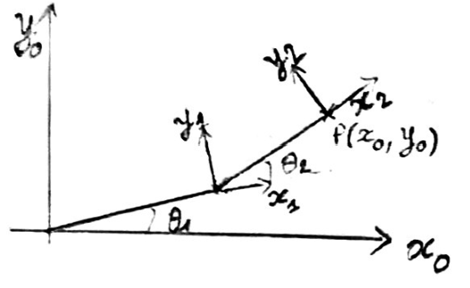

# Trajectory of a 2-joint robot arm

## OBJECTIVES:
  - Formulate the trajectory of the end-effector of a 2-DOF robotic arm
  - Solve an inverse kinematics problem
  - Use scipy.optimize to solve a system of nonlinear equations
  - Implement and compare different methods for solving the nonlinear system by minimizing the system's residuals

## Homogeneous Transformations
To solve the problem, we consider the following homogeneous transformations:
### Coordinate Frames
We define the coordinate frames of a 2-DOF robotic arm, where:
- θ₁ and θ₂ are the joint angles
- {0}, {1}, and {2} are the base and intermediate frames
- l1 and l2 are the length of each section of the arm

The rest of the implementation is on the .ipynb file.
